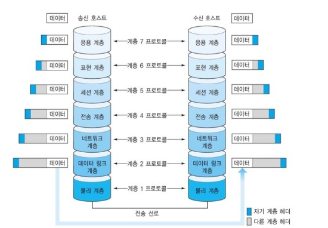

# 21.01.14 OSI 7계층

## 주요 질문

#### 💡 [OSI 7 Layer란?](#osi-7계층-계층별-설명)
   * 국제 표준 기구인 ISO 에서 제시한 네트워크 모델입니다.

   * 하위계층에는 물리 계층, 데이터 링크 계층, 네트워크 계층이 있습니다.

   * 상위계층에는 전송계층, 세션계층, 표현계층, 응용 게층이 있습니다. 

   * 네트워크가 다르면 서로 통신하기 위해 복잡한 변환 과정을 거쳐야 합니다.
   서로 다른 네트워크때문에 발생하는 호환성 문제를 막기위해 ISO에서 OSI 7계층 참조 모델을 제시했습니다.

   
#### 💡 OSI 7 계층을 나눈이유는?
   * 통신이 일어나는 과정을 단계별로 파악할 수 있기 때문입니다.
그래서 7단계 중 특정한 곳에 이상이 생기면 다른 단계의 장비 및 소프트웨어를 건들이지 않고도 이상이 생긴 단계만 고칠 수 있습니다.
   

#### 💡 [프로토콜이란?](#프로토콜-기본-요소)
   * 서로 다른 기기들 간의 데이터 교환을 위해 표준화한 통신 규약입니다.

   * 프로토콜의 기능에는 흐름제어, 오류제어, 순서제어 등이 있습니다.

   * __흐름제어__ 는 수신측에서 송신측이 송신하는 데이터의 전송량이나 전송 속도를 조절하는 기능입니다. 
   이 때, 정지 대기 방식과 슬라이딩 윈도우 방식을 사용합니다.

   * __오류제어__ 는 전송중에 발생하는 오류를 검출하고 정정하여 정보의 파손에 대비하는 기능입니다.

   * __순서제어__ 는 데이터 블록(PDU: Protocol Data Block)에 전송 순서를 부여하는 기능입니다.
   송신 데이터들이 순서적으로 전송되도록 함으로써 흐름제어 및 오류제어를 용이하게 합니다.

   * __혼잡제어__ 는 네트워크 내의 패킷 수가 넘치게 증가하지 않도록 방지하는 것입니다.
   정보의 소통량이 과다하면 패킷을 조금만 전송하여 혼잡 붕괴 현상이 일어나는 것을 막습니다.

#### 💡 패킷이란?
   * 3계층인 네트워크 계층에서 교환되는 정보의 단위입니다.
데이터 전송 시 정해진 크기와 형식에 맞도록 구성한 데이터 블록입니다.
패킷에는 번호가 붙여지고, 목적지 주소와 오류검출 비트가 포함됩니다.
   

 

## 심화 질문

 

## ⭐개념 정리

### OSI 7계층 계층별 설명
   * __물리 계층__ 은 상위 계층에서 전송된 데이터를 물리매체를 통해 다른 시스템에 전기적 신호로 전송합니다. 

   * __데이터링크 계층__ 은 네트워크 계층에서 받은 데이터를 프레임 단위로 구성하여 물리 계층으로 전송합니다. 포인트 투 포인트(Point to Point) 간 신뢰성있는 전송을 보장하기 위한 계층으로 CRC 기반의 오류 제어와 흐름 제어가 필요합니다.
   주소 값은 물리적으로 할당 받는데, 이는 네트워크 카드가 만들어질 때부터 맥 주소(MAC address)가 정해져 있다는 뜻입니다.

   * __네트워크 계층__ 은 라우팅 프로토콜을 이용해서 최적의 경로 선택합니다. 라우팅, 흐름 제어, 오류 제어 등을 수행합니다.
   논리적인 주소 구조(IP), 곧 네트워크 관리자가 직접 주소를 할당하는 구조를 가지며, 계층적(hierarchical)입니다.

   * __전송 계층__ 은 균일한 데이터 전송 서비스를 제공하는 계층입니다. 양 끝단(End to end)의 사용자들이 신뢰성있는 데이터를 주고 받을 수 있도록 해 주어 상위 계층들이 데이터 전달의 유효성이나 효율성을 생각하지 않도록 해줍니다.
   시퀀스 넘버 기반의 오류 제어 방식을 사용합니다.

   * __세션 계층__ 은 송 수신 간의 관련성을 유지하고 대화 제어를 담당합니다. 양 끝단의 응용 프로세스가 통신을 관리하기 위한 방법을 제공합니다.
   동시 송수신 방식(duplex), 반이중 방식(half-duplex), 전이중 방식(Full Duplex)의 통신과 함께, 체크 포인팅과 유휴, 종료, 다시 시작 과정 등을 수행합니다.
   이 계층은 TCP/IP 세션을 만들고 없애는 책임을 가집니다.

   * __표현 계층__ 은 서로 다른 데이터 표현 형태를 갖는 시스템 간의 상호접속을 위해 변환하는 계층입니다. 코드 간의 번역을 담당하여 사용자 시스템에서 데이터의 형식상 차이를 다루는 부담을 응용 계층으로부터 덜어 줍니다.
   MIME 인코딩이나 암호화 등의 동작이 이 계층에서 이루어집니다.

   * __응용 계층__ 은 사용자가 OSI 환경에 접근할 수 있도록 서비스를 제공합니다.

       
   

    
출처

      * https://www.crocus.co.kr/1102 
      * https://blog.naver.com/haeri056/220805367585
  

 

### OSI 7계층 장비 및 프로토콜
   * |계층|프로토콜|관련장비|프로토콜 데이터 단위(PDU)|
      |---|---|---|---|
      |1. 물리 계층|Ethernet.RS-232c|리피터, 허브|비트|
      |2. 데이터링크 게층|Mac, Ethernet|랜카드, 브릿지, 스위치|프레임|
      |3. 네트워크 계층|IP|라우터|패킷|
      |4. 전송 계층|TCP, UDP, ARP|게이트웨이|세그먼트|
      |5. 세션 계층|SSH, TLS, NetBios||메시지|
      |6. 표현 게층|ASCII, JPEG||메시지|
      |7. 응용 계층|HTTP, FTP, DNS, Telnet, DHCP||메시지|

#### 💡 허브, 스위치, 라우터
   * 허브는 물리계층의 장치로 전기적인 신호를 증폭시켜 LAN 전송거리를 연장합니다.
   허브에 연결된 장치에 오류가 발생하면 허브와 연결된 다른 장치들에도 영향을 미쳐 통신에 어려움이 발생합니다.
   * 스위치는 데이터링크 계층 장치로 MAC 주소와 포트번호가 기록된 MAC 주소 테이블을 가지고 있습니다.
   목적지 MAC 주소의 포트로만 프레임을 전송합니다.
   * 라우터는 네트워크 계층의 장치로 패킷의 위치를 추출해서 최상의 경로를 지정해줍니다.

     
   
#### 💡 "Ethernet"
   * LAN에서 가장 많이 활용되는 기술 규격입니다. 

   * 물리계층에서는 신호와 배선을 정의하고, 데이터링크 계층에서는 MAC 패킷과 프로토콜의 형식을 지정합니다.
   
### 프로토콜 기본 요소
   * 프로토콜의 기본 요소에는 구문, 의미, 시간이 있습니다.

   * __구문__ 은 전송할 데이터의 형식을 규정합니다.

   * __의미__ 는 정확한 정보 전송을 위한 두 기기간의 제어 정보를 규정합니다.

   * __시간__ 은 두 기기 간의 통신속도와 메시지의 순서 등을 규정합니다.

 
   

    
더 자세한 설명

      * https://www.notion.so/NETWORK-OSI-7-a228be5e05f54f5a8985cd0e820249c6 
      * https://github.com/WeareSoft/tech-interview/blob/master/contents/network.md#osi-7%EA%B3%84%EC%B8%B5 
    
    
  
