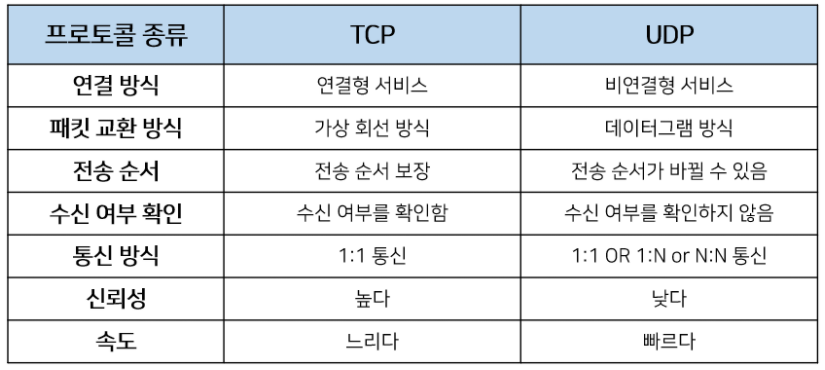
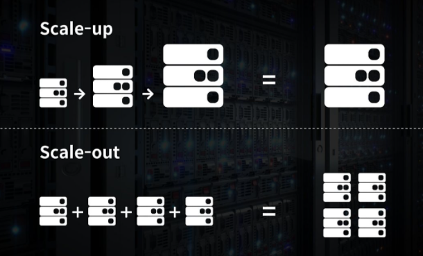

# 21.01.15 TCP & UDP

## 주요 질문

#### 💡 TCP/IP에 대해서 설명해주세요
   * 인터넷에 연결된 서로 다른 기종의 컴퓨터들이 데이터를 주고받을 수 있도록 하는 표준 프로토콜입니다.

   * TCP프로토콜과 IP프로토콜이 결합된 것을 의미합니다.

   * TCP프로토콜은 전송계층으로 신뢰성 있는 연결형 서비스를 제공합니다.

   * IP프로토코콜은 네트워크 계층으로 데이터그램을 기반으로 하는 비 연결형 서비스를 제공합니다.
   

#### 💡 TCP/IP 프로토콜 4계층
   * TCP/IP는  네트워크 액세스 계층, 인터넷 게층, 전송계층, 응용 계층으로 이루어져 있습니다.

   * __네트워크 액세스 계층__ 은 실제 데이터를 송수신하는 역할입니다.

   * __인터넷 계층__ 은 데이터 전송을 위한 주소지정, 경로설정을 제공합니다.

   * __전송 계층__ 은 호스트들 간의 신뢰성 있는 통신을 제공합니다.

   * __응용 계층__ 은 응용 프로그램 간의 데이터 송수신을 제공합니다.
   
#### 💡 TCP와 UCP의 특징과 차이점은?
   * __TCP__ (Transmission Control Protocol)는 전송제어 프로토콜로 양방향 연결형 서비스를 제공합니다.
   가상회선 연결 형태의 서비스를 제공합니다.
   신뢰성있는 전송이 중요할 때 사용하는 프로토콜 입니다.
   * __UDP__ (User Datagram Protocol)는 비연결형 서비스를 제공합니다.
   데이터를 데이터그램 단위로 처리하는 프로토콜 입니다.
   신뢰성보다는 속도가 중요한 서비스에서 사용하는 프로토콜 입니다.
   스트리밍처럼 실시간 서비스에서 주로 사용됩니다.

 

#### 💡 3-Handshaking과 4-Handshaking의 과정은?
   * 답변
   
#### 💡 로드 밸런싱이란?
   * 특정 서버에 집중되는 부하를 덜기 위해 여러 개의 서버로 분산시키는 네트워크 서비스입니다.
   Scale-out 방식으로 서버를 증설했을 때 여러 대의 서버로 트래픽을 균등하게 분산해주는 로드밸런싱이 필요합니다.
   로드 밸런싱 기법에는 여러가지가 있습니다.

      * __라운드로빈 방식(Round Robin Method)__

         서버에 들어온 요청을 순서대로 돌아가며 배정하는 방식입니다. 클라이언트의 요청을 순서대로 분배하기 때문에 여러 대의 서버가 동일한 스펙을 갖고 있고, 서버와의 연결(세션)이 오래 지속되지 않는 경우에 활용하기 적합합니다.

      * __IP 해시 방식(IP Hash Method)__

         클라이언트의 IP 주소를 특정 서버로 매핑하여 요청을 처리하는 방식입니다.사용자의 IP를 해싱해(Hashing,임의의 길이를 지닌 데이터를 고정된 길이의 데이터로 매핑하는 것,또는 그러한 함수)로드를 분배하기 때문에 사용자가 항상 동일한 서버로 연결되는 것을 보장합니다.

      *   __최소 연결 방식(Least Connection Method)__

          요청이 들어온 시점에 가장 적은 연결상태를 보이는 서버에 우선적으로 트래픽을 배분합니다. 자주 세션이 길어지거나, 서버에 분배된 트래픽들이 일정하지 않은 경우에 적합한 방식입니다.
   
#### 💡 IPV4  vs IPV6

   * IPv4는 32비트로 이루어져 2^32개의 주소를 부여할 수 있습니다.

   * IPv6 는 현재 사용하고 있는 주소 체계인 IPv4 의 주소 부족 문제를 해결하기 위해 개발되었습니다.
   128비트로 이루어져 2^128개의 주소를 부여할 수 있습니다.
   이를 통해 주소 부족 문제를 해결할 수 있습니다.

 

## 심화 질문

#### 💡 UDP에서 신뢰도, 순서를 보장하려면?
   * RUDP(Reliable UDP)
      통신이 실패했을 때 Relay 서버를 통한 데이터 재전송이 일어남
      패킷의 지연은 있을 수 있으나 피킷의 소실은 발생하지 않음.
   
#### 💡 게이트웨이란?
   * OSI 전 계층(1~7계층) 의 프로토콜 구조가 다른 네트워크의 연결을 수행합니다.
      세션 계층, 표현 계층, 응용 계층 간을 연결하여 데이터 형식 변환, 주소 변환, 프로토콜 변환 등을 수행합니다.
      LAN에서 다른 네트워크에 데이터를 보내거나 다른 네트워크로부터 데이터를 받아들이는 출입구 역할을 합니다.
   
 #### 💡 IP 주소란?

   * Internet Protocol Address로 인터넷에 연결된 모든 컴퓨터 자원을 구분하기 위한 고유 주소입니다.

   * IP주소는 네트워크 부분의 길이에 따라 A클래스에서 E클래스까지 5단게로 구성되어 있습니다.

       

#### 💡 IP란?

   * 네트워크 계층의 프로토콜로 패킷의 분해, 조립, 주소지정, 경로 선택 기능을 제공합니다.

 

## 개념 정리

### ⭐ Scale-up vs Scale-out
   *  Scale-up: 서버 자체의 성능 확장
    - CPU i3→i7
   * Scale-out: 서버 개수를 늘리는 것
   * 설명
   
   

   

    
출처

      * https://m.post.naver.com/viewer/postView.nhn?volumeNo=27046347&memberNo=2521903
  

 

    
TCP, UDP 추가 설명

      * https://www.notion.so/NETWORK-TCP-UDP-3a015a22840d4fb0b2dd4eefb5e3b199
  

 
